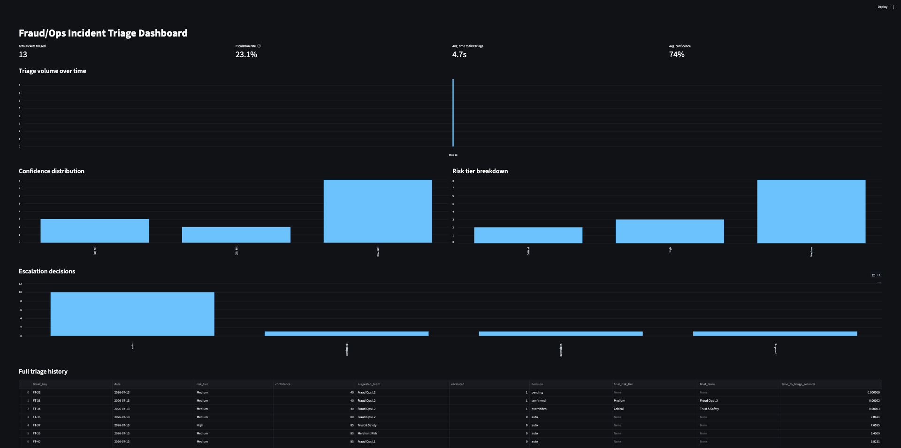
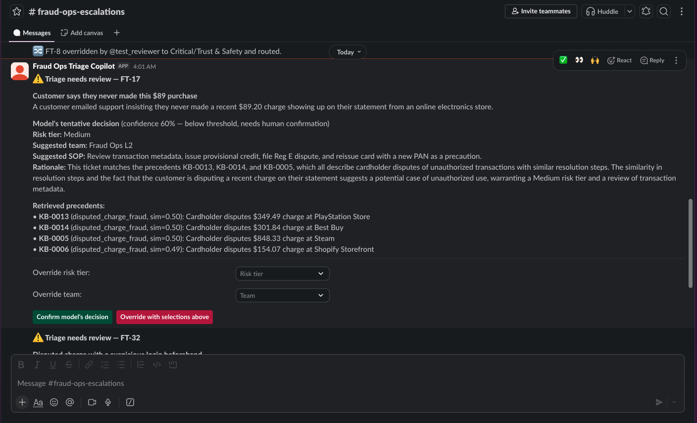
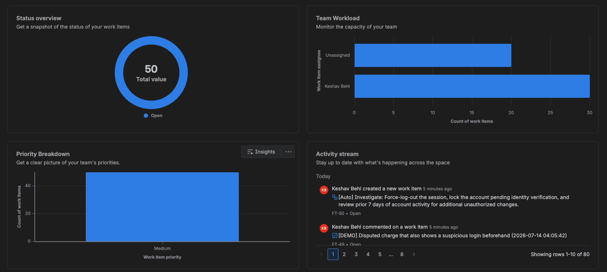

# Fraud/Ops Incident Triage Copilot

A confidence-gated triage agent for Jira Service Management: incoming fraud/ops tickets
are matched against a retrieval corpus of past resolved incidents, risk-scored and
routed automatically when the model is confident, and escalated to a human via Slack
when it isn't.

> Built a confidence-gated triage copilot for Jira Service Management: retrieves similar
> historical incidents via a NVIDIA-embedding-backed vector store, classifies risk tier
> and confidence with an LLM grounded in that precedent, auto-routes high-confidence
> cases, and escalates ambiguous ones to a human via Slack.

Built in phases per `Fraud_Ops_Triage_Copilot_Implementation_Plan.md`. See that file for
the full phase-by-phase plan and acceptance criteria.

## Status

- [x] Phase 0 — accounts & synthetic knowledge base
- [x] Phase 1 — embedding ingestion pipeline
- [x] Phase 2 — Jira Service Management webhook listener
- [x] Phase 3 — RAG retrieval layer
- [x] Phase 4 — LLM triage classifier
- [x] Phase 5 — auto-routing & sub-task creation
- [x] Phase 6 — confidence-gated escalation
- [x] Phase 7 — SLA timer & triage dashboard
- [x] Phase 8 — end-to-end testing, demo script, polish

## Architecture

```
Jira Service Management (JSM)
        │  issue created (Automation → send web request)
        ▼
FastAPI  POST /webhooks/jira  ────────────────────────────────┐
        │                                                     │
        ▼                                                     │
RAG retrieval (Chroma + NVIDIA nv-embedqa-e5-v5)              │
        │ top-k similar resolved tickets                      │
        ▼                                                     │
LLM triage classifier (NVIDIA meta/llama-3.1-8b-instruct)     │
        │ risk_tier + confidence + suggested_team + rationale │
        ▼                                                     │
   confidence >= threshold? ────────── no ──────────┐         │
        │ yes                                       ▼         │
        ▼                                  Slack escalation   │
Auto-route: labels, assignee,              (Block Kit msg +   │
sub-task for High/Critical                  Confirm/Override) │
        │                                           │         │
        ▼                                           ▼         │
        └──────────────► SQLite triage_history ◄────┘         │
                                │                             │
                                ▼                             │
                    Streamlit dashboard ◄─────────────────────┘
```

## Setup

```bash
python3 -m venv .venv
source .venv/bin/activate
pip install -r requirements.txt
cp .env.example .env   # fill in your NVIDIA / Jira / Slack credentials
python3 data/generate_synthetic_kb.py
python3 -m app.ingest.embed_kb
```

Additional one-time setup outside the code (see `Fraud_Ops_Triage_Copilot_Implementation_Plan.md`
for full step-by-step accounts setup):

1. **NVIDIA**: get a free API key at build.nvidia.com.
2. **Jira**: enable Jira Service Management on your site, create a project, get an API token.
3. **Slack**: create an app with the `chat:write`, `channels:read`, `groups:read`, and
   `channels:join` bot scopes, install it to your workspace, and create/join the
   escalation channel.
4. **ngrok**: `brew install ngrok`, add your authtoken, then `ngrok http 8000` to expose
   the local FastAPI server for Jira's webhook and Slack's interactivity request URL.
5. Register a Jira Automation rule (issue created → send web request to
   `<ngrok-url>/webhooks/jira`) and a Slack Interactivity Request URL
   (`<ngrok-url>/slack/interactions`).

Run the server:

```bash
uvicorn app.main:app --reload --port 8000
```

## Demo scenarios

Run a batch of synthetic tickets through the real end-to-end pipeline:

```bash
python3 -m scripts.run_demo_tickets
```

This exercises all three narrative scenarios in one run:

1. **Clear-cut low-risk ticket** (e.g. a false-positive fraud block) → auto-routes
   instantly (labels, assignment, audit comment), dashboard volume updates.
2. **Clear-cut high-risk ticket** (e.g. a card-testing attack or account takeover) →
   auto-routes *and* creates a linked investigation sub-task.
3. **Ambiguous ticket** (blended signals, e.g. "chargeback or fraud — unclear which") →
   confidence comes in below the threshold, so it escalates to Slack instead of
   silently auto-routing, where a human clicks Confirm (applies the model's suggestion)
   or Override (picks a different risk tier/team) — both are logged to `triage_history`.

`scripts/smoke_test.py` and `tests/` cover the individual phases end-to-end against the
real Jira/Slack/NVIDIA APIs.

## Dashboard

```bash
streamlit run dashboard/app.py
```

Opens at http://localhost:8501. Reads directly from the local `triage_history`
SQLite table populated by the pipeline — no separate server needed.



## Screenshots

**Slack escalation** — an ambiguous ticket below the confidence threshold, with the
retrieved precedents and Confirm/Override controls:



**Jira Service Management space** — tickets flowing through as real JSM work items:


